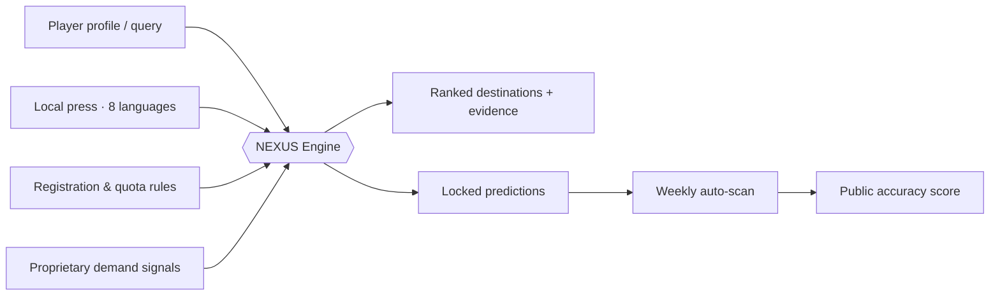

# NEXUS

**Agent-First Transfer Intelligence Platform**
*Built and operated by L&K Agency*

[**▶ Live Showcase**](https://gunnerista.github.io/NEXUS/) · [About L&K](#about) · [How it works](#how-it-works)

  

---

## What is NEXUS?

Most football scouting tools tell you **how good a player is**. NEXUS answers a different question — the one an agent actually gets paid for:

> **"Which club, right now, genuinely needs this player and will actually move this window?"**

NEXUS reads live squad gaps, registration rules, and window deadlines across **15 markets in 8 languages**, ranks realistic destinations with evidence attached, and then does something most platforms never dare to do: **it predicts transfer outcomes in advance, locks the prediction, and publicly scores itself when the player signs.**

---

## Modules

### 🗺 League Boards
Pick a league, see only that market: window deadline, registration and foreigner rules, and which clubs have a **verified open need** right now — graded HOT / WARM / DEAD, every claim dated and sourced.

### 🔄 Reverse Match
The selling-side engine. Player profile in → ranked destination clubs out, each with a match index, the reasons behind the rank, and an explicit `Verify` flag on anything that could not be confirmed live. Club identities are anonymized while a deal is active.

### 🎯 FA Prediction Tracker
For a pool of real, currently unattached free agents, NEXUS predicts the destination league and top-3 clubs — then **locks the prediction with a date**. No retro-editing, ever.

### 📊 Accuracy Scoreboard
When a tracked player signs, the system grades itself:

| Result | Points |
|---|---|
| Exact club in predicted top 3 | **3** |
| Right league, different club | **2** |
| Adjacent / same-tier market | **1** |
| Miss | **0** |

First calibration cases: one **exact club hit** (P1 predicted, player signed there days later) and one adjacent-market resolution. The scoreboard only gets more meaningful as the sample grows — that is the point.

---

## How it works

Three ranking axes, in strict priority order: **league level & guaranteed minutes** → **budget & wage fit** → **position & squad gap verified against this week's news**. A club must clear all three.

Two design principles that make the output trustworthy:

1. **Dated snapshots, not vague claims.** Every board carries an "as of" date; every finding carries a source. What can't be verified gets a flag, not an assertion.
2. **Demand signals over headlines.** A loud injury story doesn't make a club a buyer. NEXUS weighs quiet preparation moves and relationship-level signals above public emergencies — a hierarchy learned and validated on live deals.

> 🔒 **Proprietary core.** Scoring weights, data pipeline, and source integrations are L&K Agency IP and are not published. This repository hosts the public showcase only.

---

## Stack

Single self-contained HTML showcase (zero dependencies, GitHub Pages) on top of an **agentic AI research loop** that performs multilingual press scanning, rule verification, and structured ranking. Private modules (internal console with full deal data, contact-log demand layer, interactive query app) run separately and are not public.

**Roadmap:** interactive private web app — profile in, full analysis out, on demand.

---

## About

**L&K Agency** is a sports investment and deal-making agency operating across football club M&A, player placement, sponsorship, and esports — Europe, MENA, Asia, and the Americas.

Designed & operated by **Ikjun Jang** · [GitHub](https://github.com/Gunnerista) · ikjunj19@gmail.com

© 2026 L&K Agency. Showcase data is compiled from public sources and anonymized where deals are active. Engine internals are proprietary.
