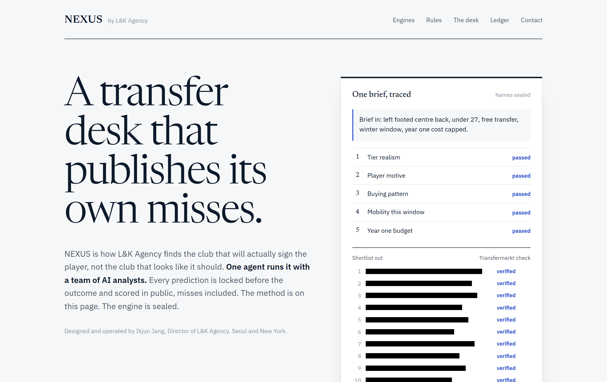
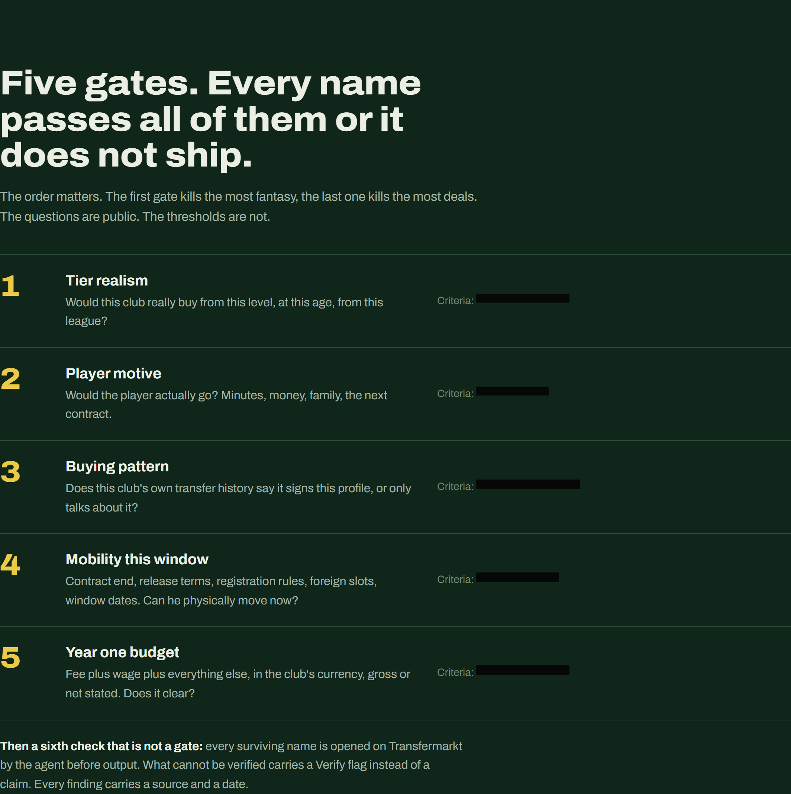
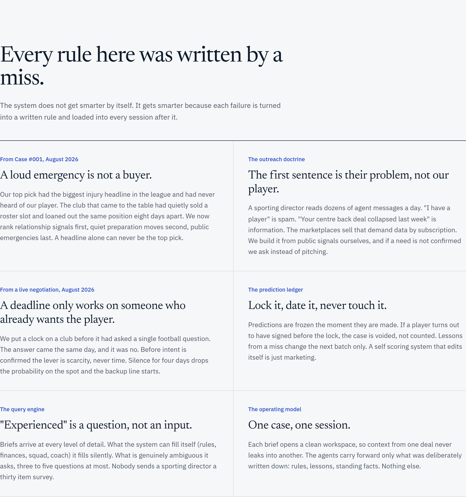
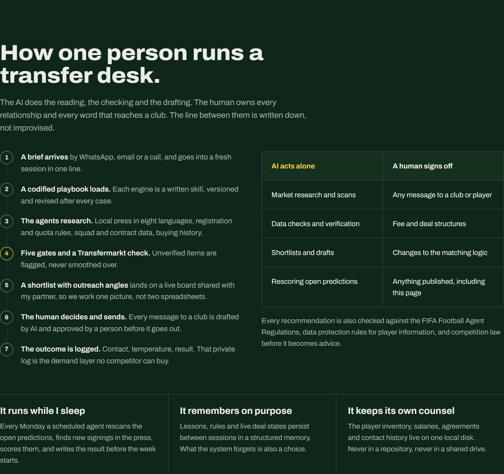
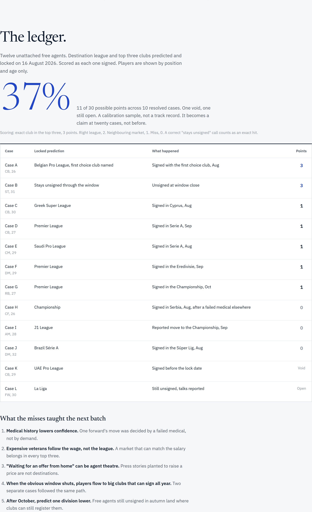

# NEXUS

**A transfer desk that publishes its own misses.**
*Agent-first transfer intelligence, built and operated by L&K Agency.*

[**Open the live showcase**](https://gunnerista.github.io/NEXUS/)

  -ebcb45) 

---

## The question NEXUS answers

Scouting platforms tell you how good a player is. An agent gets paid for something else:

> **Which club, right now, will actually sign this player, and why?**

NEXUS answers that in both directions, with one agent running it alongside a team of AI analysts. Every prediction it makes is locked before the outcome and scored in public, misses included.

## Two engines

**Demand Match.** Club brief in, ten verified players out. Each brief starts from zero: full open market research, five gates, then every surviving name is checked on Transfermarkt before it leaves the desk. Each pick ships with why it fits and the first sentence of the pitch.

**Reverse Match.** Player profile in, ranked destination clubs out, tiered into contact now, follow up, and monitor. Evidence on every rank, Verify flags on anything unconfirmed, counterparties anonymous while a deal is live.

Both are built for the long tail of the market (Balkan and Eastern European top flights, the Gulf, K League, USL) where free agents move on modest wages and no clean database exists. That is why NEXUS reasons like an agent instead of querying like a database.

## Five gates

Tier realism, player motive, buying pattern, mobility this window, year one budget. The questions are public. The thresholds are sealed.

## Rules written by misses

Every rule in the system traces back to a specific failure, then gets loaded into every session after it. A loud emergency is not a buyer. The first sentence of outreach is their problem, not our player. A deadline only works on someone who already wants the player. Lock it, date it, never touch it.

## How one person runs the desk

AI agents read, verify and draft. A human owns every relationship and approves every word that reaches a club. Each engine is a codified, versioned playbook. A scheduled agent rescans open predictions every Monday. Lessons persist between sessions in structured memory; client data never leaves one local disk.

## The ledger

Twelve unattached free agents, destinations locked on 16 August 2026. Ten resolved, 11 of 30 points, one void, one open. Players are anonymized to position, age and market. Scoring: exact club in the top three 3, right league 2, neighbouring market 1, miss 0.

That is a calibration sample, not a track record. It becomes a claim at twenty cases. Every new case is added whether it scores 3 or 0.

## What is published, and what is not

| Published | Sealed |
|---|---|
| Architecture and gate order | Gate thresholds and ranking weights |
| Operating rules and their origin cases | Agent playbooks and prompts |
| The full prediction ledger | Source pipeline |
| The AI and human authority split | Player inventory, agreements, contacts |

This repository contains the showcase only. There is no engine code here.

## Work with L&K

**A club with an open position:** send the position, budget band and registration limits. You get a dated shortlist with sources and flags.
**A player or intermediary:** send the profile and fee situation. Reverse Match returns ranked destinations with reasoning.
**An investor or owner:** L&K's club M&A and sponsorship desks run on the same method.

📧 **ikjunj19@gmail.com**, subject `NEXUS`

---

## License

© 2026 L&K Agency. All rights reserved. See [LICENSE](LICENSE).

This is a published showcase, not open source. It may be read and linked. It may not be copied, redistributed or reused in a derivative product.

Designed and operated by **Ikjun Jang**, Director, L&K Agency (Seoul and New York). Ledger players are anonymized to position, age and market. Clubs in live deals are never named.
