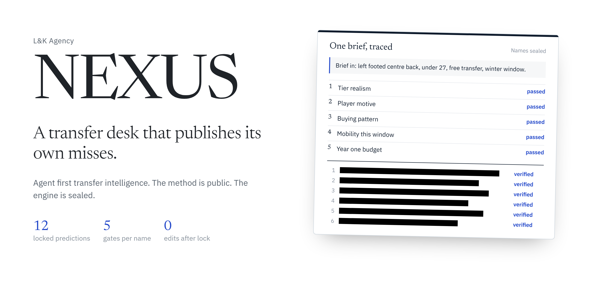
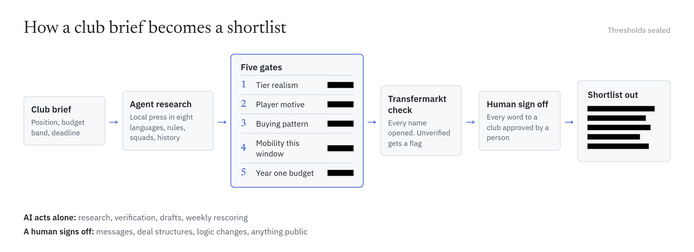
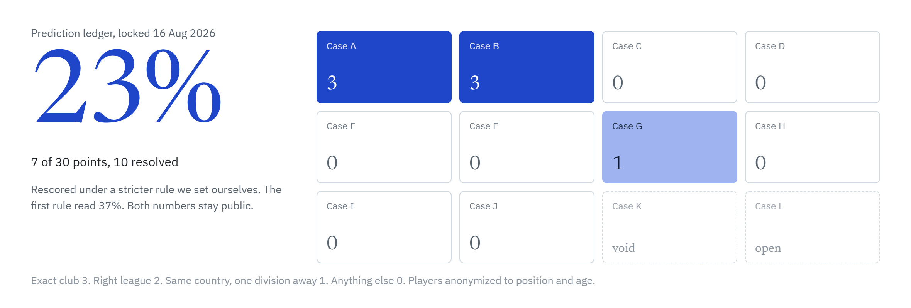

<picture>
  <source media="(prefers-color-scheme: dark)" srcset="assets/banner-dark.png">
  
</picture>

  <a href="https://gunnerista.github.io/NEXUS/"><b>Open the live showcase</b></a>
  &nbsp;&nbsp;|&nbsp;&nbsp;
  <a href="#the-ledger">Ledger</a>
  &nbsp;&nbsp;|&nbsp;&nbsp;
  <a href="#rules-written-by-misses">Rules</a>
  &nbsp;&nbsp;|&nbsp;&nbsp;
  <a href="#work-with-lk">Contact</a>

## The question

Scouting platforms rate players. An agent gets paid for a different answer:

> **Which club, right now, will actually sign this player, and why?**

NEXUS answers it in both directions. One agent runs it with a team of AI analysts, and every prediction is locked before the outcome and scored in public.

| Engine | Input | Output |
|---|---|---|
| **Demand Match** | A club brief: position, budget band, deadline | Ten verified players, each with the reason it fits and the first line of the pitch |
| **Reverse Match** | A player profile | Ranked destination clubs, tiered into contact now, follow up, monitor |

It is built for the long tail (Balkan and Eastern European top flights, the Gulf, K League, USL), where free agents move on modest wages and no clean database exists. That is why NEXUS reasons like an agent instead of querying like a database.

## How a brief moves

<picture>
  <source media="(prefers-color-scheme: dark)" srcset="assets/pipeline-dark.png">
  
</picture>

The questions behind each gate are public. The thresholds, weights, playbooks and source pipeline are not.

## The ledger

<picture>
  <source media="(prefers-color-scheme: dark)" srcset="assets/ledger-dark.png">
  
</picture>

Twelve unattached free agents, destinations locked on 16 August 2026 and never edited. On 5 October we tightened our own scoring rule: a point for a "comparable market" became a point only for the same country, one division away. The score fell from 37% to 23%. Both numbers stay public, because a ledger that flatters itself is just marketing.

Ten cases is a calibration sample, not a track record. It becomes a claim at twenty.

## Rules written by misses

Every rule in the system traces back to a specific failure and is loaded into every session after it.

| Rule | Where it came from |
|---|---|
| **A loud emergency is not a buyer.** | The club with the biggest injury headline had never heard of our player. The buyer had quietly freed a slot eight days earlier. |
| **The first sentence is their problem, not our player.** | Directors skim dozens of agent messages a day. A confirmed need gets read. "I have a player" does not. |
| **A deadline only works on someone who already wants the player.** | A clock set before intent was confirmed got a same day no. |
| **Lock it, date it, never touch it.** | Predictions freeze at the lock. Pre signed cases are voided, not counted. |
| **One case, one session.** | Each brief opens a clean workspace so no deal leaks into another. |

## How one person runs the desk

AI agents read, verify and draft. A human owns every relationship and approves every word that reaches a club. Each engine is a written, versioned playbook. A scheduled agent rescores open predictions every Monday. Client data, salaries and contact history live on one local disk and never in a repository.

## What this repository is

| Published | Sealed |
|---|---|
| Architecture and gate order | Gate thresholds and ranking weights |
| Operating rules and their origins | Agent playbooks and prompts |
| The full ledger, rescoring included | Source pipeline |
| The AI and human authority split | Player inventory, agreements, contacts |

This repository holds the showcase only. There is no engine code here.

## Work with L&K

| You are | Send | You get |
|---|---|---|
| A club | Position, budget band, registration limits | A dated, sourced shortlist with Verify flags |
| A player or intermediary | Profile and fee situation | Ranked destinations with the reasoning attached |
| An investor or owner | The opportunity | L&K's M&A and sponsorship desks, same method |

📧 **ikjunj19@gmail.com** with subject `NEXUS`

---

© 2026 L&K Agency. All rights reserved. A published showcase, not open source: it may be read and linked, not copied, redistributed or reused in a derivative product. See <a href="LICENSE">LICENSE</a>. Ledger players are anonymized to position, age and market. Designed and operated by Ikjun Jang, Director, L&K Agency, Seoul and New York.
